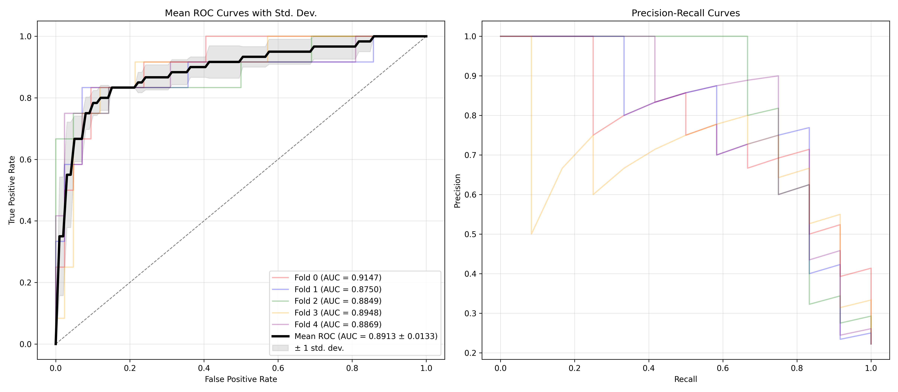
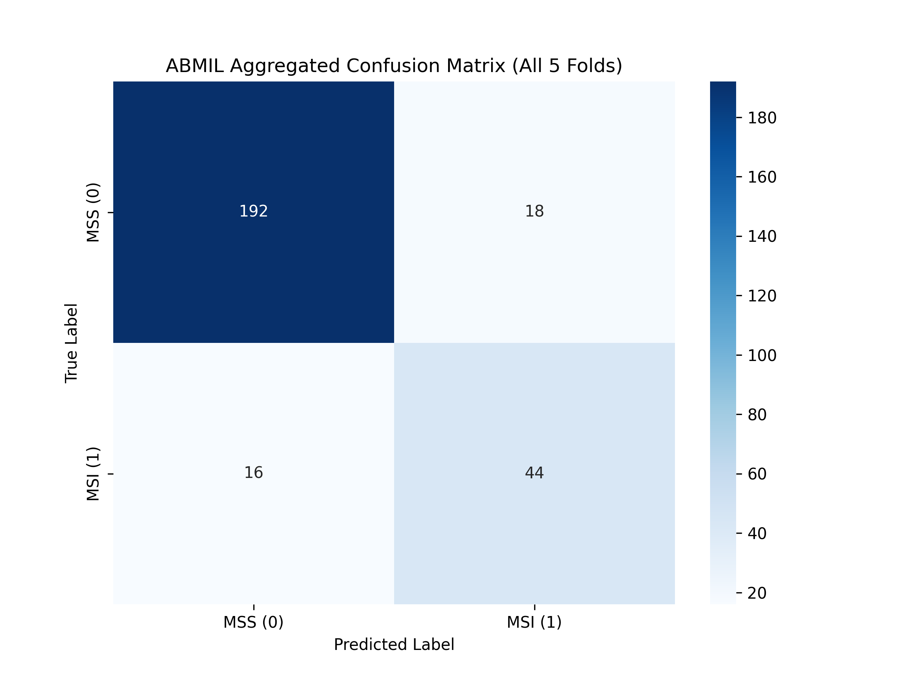
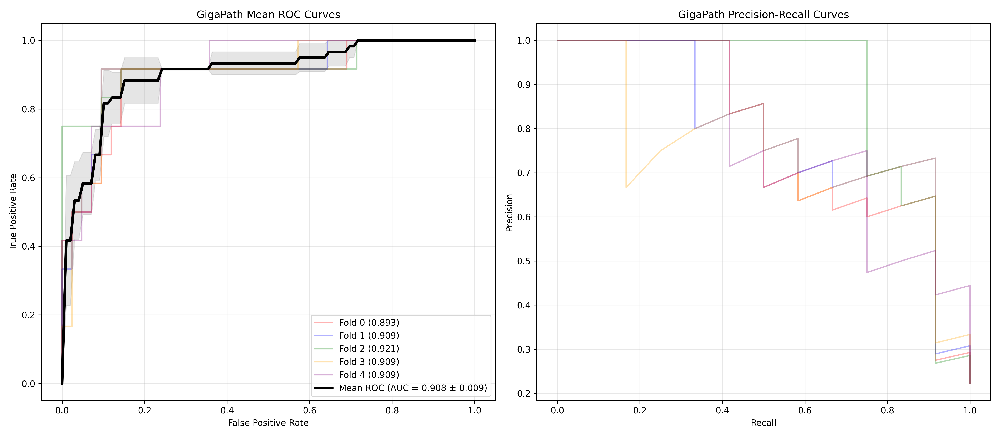
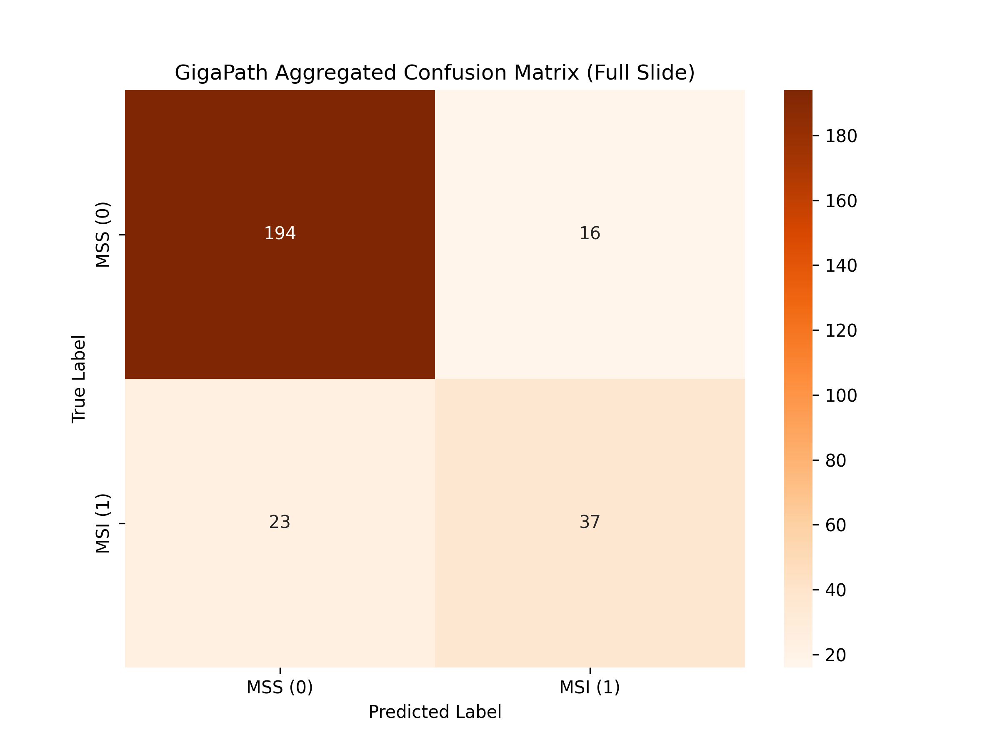

### **WSI 전처리 자동화 (`TRIDENT`)**

- `extract_features_batch_wsi.py`: `common_manifest.txt`에 정의된 환자 슬라이드의 GDC 다운로드-조직 분류-패치 분할-특성 추출-캐시 삭제 전 과정을 자동화합니다.

```bash
# 여러 슬라이드 배치 처리 및 전처리 절차 실행
python ./TRIDENT/run_batch_of_slides.py \
    --task all \
    --wsi_dir {WSI_FLAT_DIR} \
    --job_dir {RESULT_DIR} \
    --patch_encoder {PATCH_ENCODER} \
    --batch_size 32 \
    --segmenter grandqc \
    --remove_penmarks \
    --mag 20 \
    --patch_size 256
```

- **사전학습 모델:** HuggingFace의 UNI_v2 / Prov-GigaPath 가중치를 사용합니다. (HuggingFace 포털에서 사용 승인 필요)
- **조직 분할:** H&E 염색에 최적화된 GrandQC 모델을 사용하며, 펜 자국 제거(`--remove_penmarks`) 옵션을 지원합니다. **(GPU 필수)**
- **패치 추출:** SVS 파일의 메타 정보를 읽어 **20배율**로 고정한 후, **256x256** 크기로 패치를 분할합니다.
- **결과물 저장:** 슬라이드 단위로 저장(H5 형식)되며, 추후 멀티모달 학습 시 환자 단위 병합이 필요합니다.
    - **이미지 임베딩 벡터 예시:** `TCGA-AA-A01T-01Z...DX1.h5` → `(num_patch, features)` = `(3331, 1536)`
    - **좌표 벡터 예시:** `TCGA-AA-A01T-01Z...DX1_patches.h5` → `(num_patch, coords(x, y))` = `(3331, 2)`
- **공간 확보:** 배치 단위로 다운로드 및 특성 추출이 완료되면, 원본 WSI(SVS) 파일은 자동으로 삭제됩니다.
- **서버 저장 경로 (Linux):**
    - UNI v2: `~/data/trident_processed`
    - GigaPath: `~/data/gigapath_processed`

#### **전처리 단계별 시각화 예시**

<div align="center">
    <br>
    <em>Thumbnail</em>
    <br><br>
    <br>
    <em>Tissue Segmentation</em>
    <br><br>
    <br>
    <em>Patch Extraction (Tiling)</em>    
</div>

---

### **테스트용 ABMIL 이미지 추론 모델**

- `config.py`: 랜덤 시드, 정답지 분할, 각종 경로 설정(정답지, 모델 저장, 테스트 결과, 시각화 자료 등)
- `h5dataset.py`, `binary_focal_loss.py`: Dataset 및 Focal Loss 정의
- `abmil_model.py`: 이진 분류 모델
- `abmil_train.py`: TRIDENT 내장 Attention-based Multi Instance Learning 5-fold 교차검증 훈련
- `abmil_test.py`: ABMIL 모델 테스트
- `ablmil_visualize_hitmap.py`: 어텐션 스코어를 히트맵으로 시각화

<div align="center">
    <br>
    <em>AUC/AUPRC Curve</em>
    <br><br>
    <br>
    <em>Confusion Matrix</em>
    <br><br>
    <br>
    <em>Visualize Attention Score</em>
</div>

---

### **테스트용 GigaPath 이미지 추론 모델**

- `config.py`: 랜덤 시드, 정답지 분할, 각종 경로 설정(정답지, 모델 저장, 테스트 결과, 시각화 자료 등)
- `h5dataset.py`, `binary_focal_loss.py`: Dataset 및 Focal Loss 정의
- `gigapath/classification_head.py` : gigapath 이진 분류 모델
- `gigapath_train.py`: xformers(flash_attn 대체)를 사용한 경량 ViT 모델로 5-fold(Stratified) 교차검증 훈련. Focal Loss(불균형 데이터 가중치) 손실함수 채택
- `gigapath_test.py`: 저장된 GigaPath 모델 테스트용 코드
- `gigapath_visualize.py`: PCA 시각화

<div align="center">
    <br>
    <em>AUC/AUPRC Curve</em>
    <br><br>
    <br>
    <em>Confusion Matrix</em>
    <br><br>
    <br>
    <em>PCA Visualization</em>
</div>
