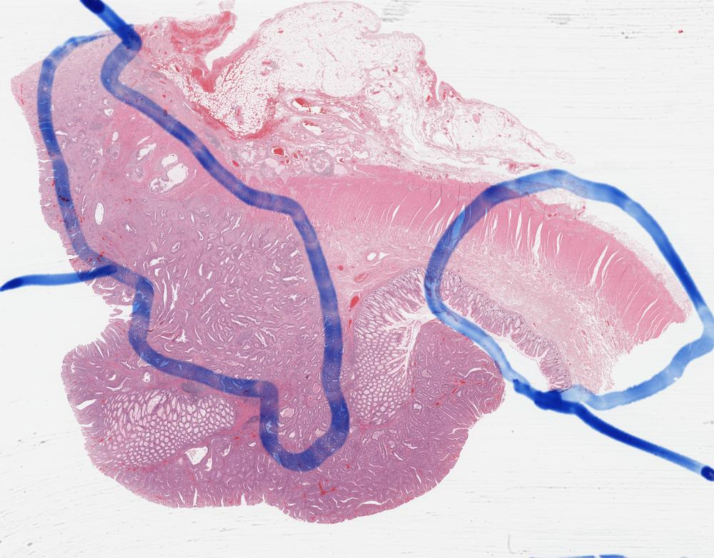
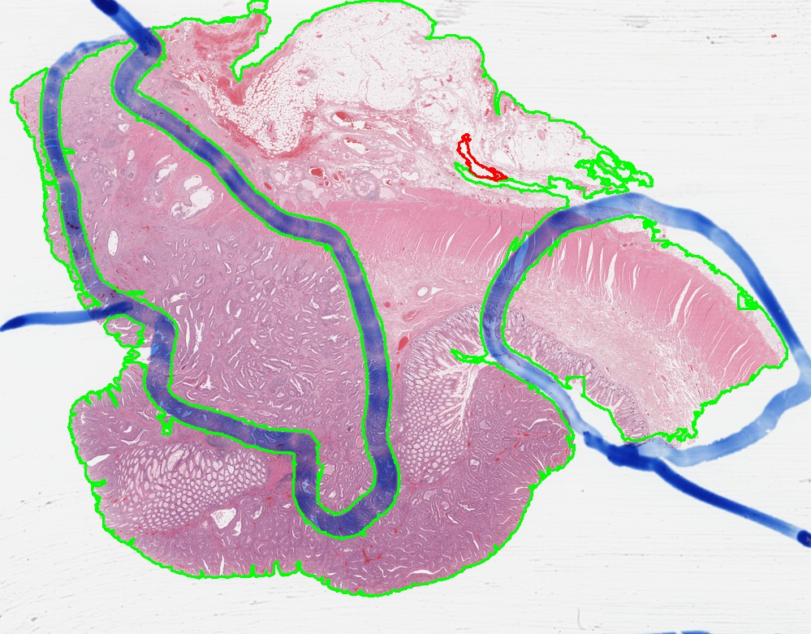
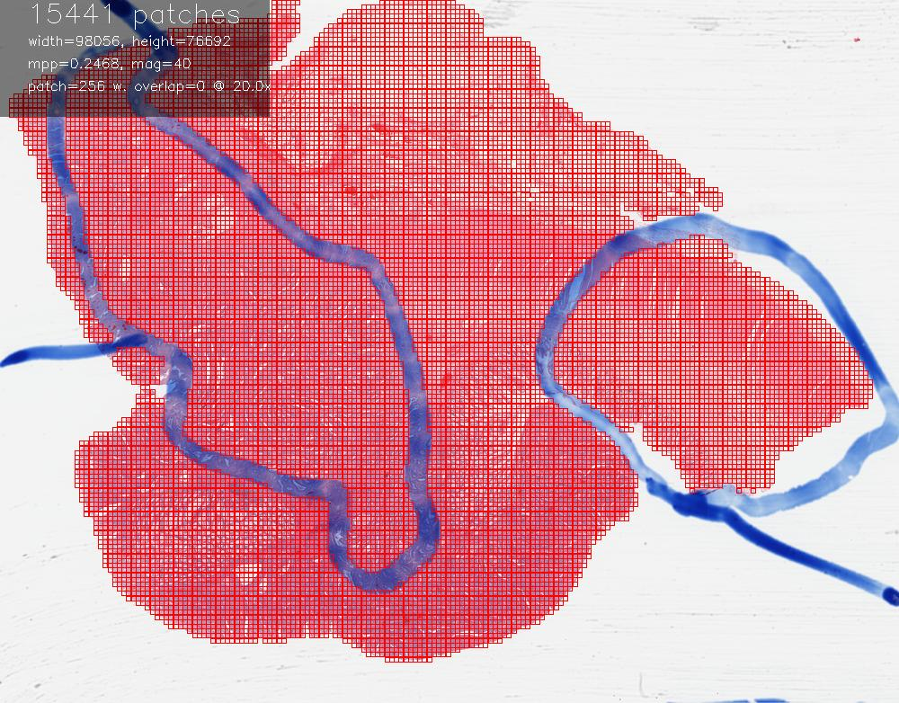
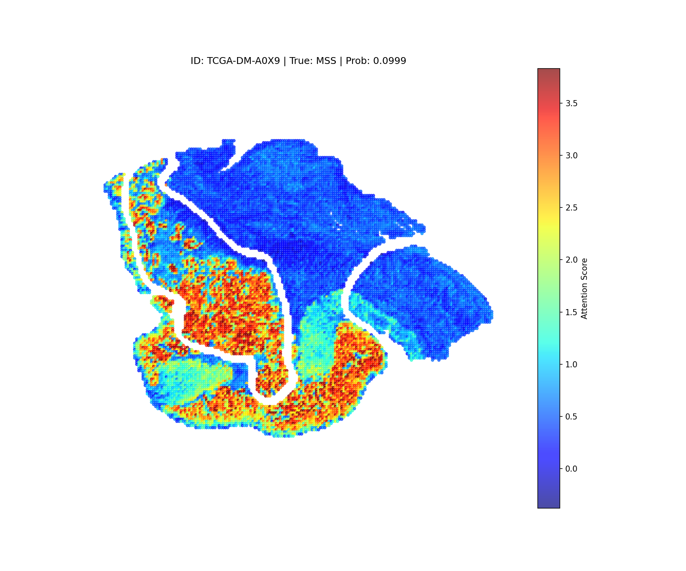

### **WSI 전처리 자동화**
- extract_features_batch_wsi.py : common_manifest.txt에 있는 환자 슬라이드를 gdc에서 다운로드-조직분류-패치분할-특성추출-캐시삭제 자동화
- huggingface의 UNI_v2/Prov-GigaPath 사전학습 모델 가중치 사용(huggingface에서 사용 승인 필요)
- H&E 염색에 최적화된 GrandQC 모델을 사용, 펜 자국 제거(--remove_penmarks) -> GPU 필수!
- svs 파일의 메타 정보를 읽어 20배율로 고정한 후 256x256 크기로 패치 분할 
- 슬라이드 단위로 저장되며, 추후 멀티모달 학습 시 환자단위 병합 필요
- 배치 단위로 다운로드-특성 추출 후 공간확보를 위해 원본 WSI가 삭제됨
- 저장경로(리눅스 서버) : ~/data/trident_processed

Thumbnail

Tissue Segmentation

Patch Extraction

Visualize Attention Score

### **테스트용 ABMIL**
- config.py : 랜덤 시드, 정답지 분할, 각종 경로(정답지, 모델 저장, 테스트 결과, 시각화 자료 등), 공통 사용 클래스 정의
- train_abmil.py : TRIDENT 내장 Attention-based Multi Instance Learning 5-fold 교차검증 훈련
- test_abmil.py : ABMIL 테스트
- visualize_hitmap.py : 어텐션 스코어를 히트맵으로 시각화
